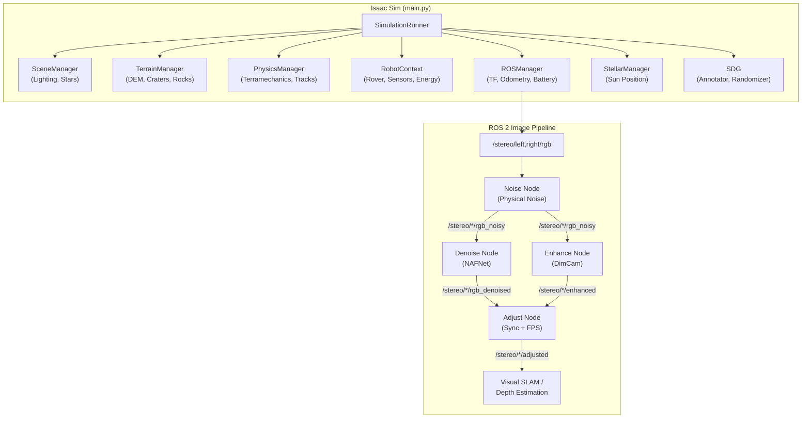

# Lproject_sim

**High-Fidelity Lunar Rover Simulation Environment for NVIDIA Isaac Sim**

Lproject_sim is an Isaac Sim-based simulation platform for lunar surface rover operations. It provides procedural terrain generation with craters and rocks, physics-based sensor noise simulation, terramechanics, thermal/energy modeling, and a full ROS 2 interface for stereo camera image processing — including noise injection, denoising (NAFNet), and low-light enhancement (DimCam).

> Built on **Ubuntu 24.04** · **NVIDIA Isaac Sim 5.0** · **ROS 2 Jazzy** · **CUDA 12.x** · **Python 3.11 (Isaac Sim) + 3.12 (ROS 2)**

---

## Table of Contents

- [Overview](#overview)
- [Key Features](#key-features)
- [System Architecture](#system-architecture)
- [System Components](#system-components)
- [Prerequisites](#prerequisites)
- [Usage](#usage)
- [Image Processing Pipeline](#image-processing-pipeline)
- [Project Structure](#project-structure)
- [Configuration](#configuration)

---

## Overview

Lproject_sim generates realistic lunar surface environments and simulates a rover equipped with stereo cameras, sun sensors, solar panels, and full energy/thermal subsystems. The simulation publishes all sensor data over ROS 2 topics, enabling downstream visual SLAM, depth estimation, and autonomous navigation stacks to operate as if connected to real hardware.


<div align="center">
  <video src="https://private-user-images.githubusercontent.com/191950039/567748976-971185f6-6408-4b7c-9766-06172e7187b0.mp4" width="100%" controls></video>
</div>

| Feature | Description |
|---------|-------------|
| **Terrain** | Procedural DEM with craters, Perlin noise, rock scattering, and outer terrain with mountain rims |
| **Physics** | Lunar gravity (1.62 m/s²), terramechanics, wheel track rendering, terrain deformation |
| **Sensors** | Stereo RGB cameras, depth camera, sun sensor, IMU (via OmniGraph) |
| **Noise** | Physics-based camera noise model (shot noise, dark current, read noise, FPN, PRNU) |
| **Lighting** | Stellar engine for physically-accurate sun position based on lat/lon/time |
| **Robot** | Husky rover with solar panel, energy management, and thermal modeling |

---

## Key Features

- **Procedural Lunar Terrain** — DEM-based terrain with crater profiles, Perlin noise, rock scattering, and seamless outer terrain blending with mountain rims
- **Physics-Based Camera Noise** — Moseley et al. (CVPR 2021) inspired noise model: shot noise, read noise, dark current, FPN, PRNU
- **NAFNet Denoising** — Real-time image denoising using NAFNet (ECCV 2022, 40.30 dB PSNR on SIDD)
- **DimCam Low-Light Enhancement** — Custom DimCam model for extreme low-light image recovery
- **Stellar Engine** — Skyfield-based sun/earth position calculation from lunar lat/lon and UTC time
- **Energy & Thermal Modeling** — Solar panel power generation, battery charge/discharge, 6-face thermal model
- **Terramechanics** — Wheel-soil interaction simulation with sinkage, slip, and drawbar pull
- **Synthetic Data Generation** — Omni Replicator-based SDG with domain randomization and auto-labeling
- **12 Scene Variants** — Pre-saved scenes: 3 rock levels × 2 lighting conditions × 2 terrain modes (`s1`–`s12`)
- **ROS 2 Native Integration** — All sensor data published via ROS 2 topics with full TF tree support

---

## System Architecture



---

## System Components

### Core (`src/core/`)

| Module | Description |
|--------|-------------|
| **SimulationRunner** | Main orchestrator. Initializes all subsystems, manages the simulation loop, handles scene save/load with 12 variants (`s1`–`s12`). |
| **SceneManager** | Lunar environment lighting (DistantLight at 5778K color temperature) and star field generation (emissive spheres). |
| **ROSManager** | Native ROS 2 node running inside Isaac Sim. Publishes TF (`map→base_link`), odometry, battery state, sensor temperature, and sun vector. |
| **RobotContext** | Encapsulates a single robot with its sensors (sun sensor), components (solar panel), and managers (energy, thermal, latency). |
| **SimManager** | Physics scene setup (lunar gravity 1.62 m/s²) and simulation step control. |
| **StellarManager** | Skyfield-based celestial engine. Computes physically-accurate sun position from lunar latitude, longitude, and UTC time. |
| **EnergyManager** | Battery charge/discharge modeling, solar power generation (incidence angle-based), motor load calculation. |
| **ThermalModel** | Six-faced box thermal model with per-face view factors, sun exposure tracking, and temperature-dependent behavior. |
| **LatencyManager** | Simulates Earth-Moon communication delay (~1.3 s) and packet dropout. |
| **SceneIO** | Scene save/load utilities for USD files. Manages 12 pre-saved scene variants. |

---

### Terrain (`src/terrain/`)

| Module | Description |
|--------|-------------|
| **TerrainGenerator** | Procedural DEM generation using Perlin noise and spline-based crater profiles. |
| **TerrainManager** | Full terrain pipeline: DEM mesh creation, physics material application, outer terrain with mountain rims and large craters, rock scattering with semantic labels, and height sampling. |

---

### Physics (`src/physics/`)

| Module | Description |
|--------|-------------|
| **PhysicsManager** | Manages terramechanics, wheel track rendering, dust emission, and DEM stamping for all robots. |
| **TerramechanicsSolver** | Wheel-soil interaction: sinkage, slip ratio, drawbar pull based on Bekker/Wong theory. |
| **WheelTrackRenderer** | Ribbon mesh-based visual wheel tracks (fast, GPU-friendly). |
| **Deformation** | Terrain mesh deformation from wheel contact. |

---

### ROS 2 Nodes (`src/nodes/`)

| Node | Description |
|------|-------------|
| **noise_node** | Physical sensor noise simulation. Shot noise, read noise, dark current (temperature-dependent), FPN, PRNU. Supports stereo synchronization. |
| **denoise_node** | NAFNet-based real-time denoising (ECCV 2022). Supports width-32 and width-64 models with LAB color transfer post-processing. |
| **enhance_node** | DimCam low-light image enhancement. Processes synchronized stereo pairs with GPU inference. |
| **adjust_node** | Stereo image synchronizer and FPS throttler. Ensures stable synchronized output for downstream pipelines. |
| **normalize_node** | Simple brightness enhancement (Gamma / Linear / CLAHE) for comparison with DimCam. |
| **slope_costmap_node** | Computes slope-based OccupancyGrid from PointCloud2 for Nav2 costmap integration. |
| **solar_control_node** | Solar panel sun-tracking controller. Subscribes to sun vector and publishes optimal panel angle. |

---

### Other Modules

| Module | Path | Description |
|--------|------|-------------|
| **Rover** | `src/robots/rover.py` | Husky rover model with differential drive, joint control, and OmniGraph-based ROS 2 bridge setup. |
| **SolarPanel** | `src/robots/solar_panel.py` | Deployable solar panel with angular control and sun-facing normal vector calculation. |
| **SunSensor** | `src/sensors/sun_sensor.py` | Sun direction detection via raycast with shadow detection capability. |
| **DustManager** | `src/environment/dust_manager.py` | Particle-based dust emission from wheel-terrain contact. |
| **HUD** | `src/ui/hud.py` | Real-time on-screen display showing battery, temperature, sun angle, position, and system status. |
| **Annotator** | `src/sdg/annotator.py` | Omni Replicator-based auto-labeling: RGB, depth, semantic/instance segmentation, bounding boxes. |
| **SDGRandomizer** | `src/sdg/randomizer.py` | Domain randomization: sun position/intensity, rock placement, camera exposure, texture variation. |
| **RenderingManager** | `src/rendering/rendering_manager.py` | Renderer configuration (RTX, lens flare, motion blur, DLSS). |

---

## Assets Download

The `assets/` folder (~3 GB) is hosted on Google Drive and is not included in this repository.

**Download (one-time setup):**

```bash
bash scripts/download_assets.sh
```

This script installs `gdown` (if needed) and downloads the following into `assets/`:

| Folder | Size | Contents |
|--------|------|----------|
| `USD_Assets/` | ~1.2 GB | Rock & rover USD models |
| `Textures/` | ~1.1 GB | Lunar regolith MDL materials |
| `Terrains/` | ~55 MB | DEM data & crater profiles |
| `Ephemeris/` | ~18 MB | Skyfield ephemeris files |

> Google Drive folder: https://drive.google.com/open?id=1H0jR8eA9DT5elJcx0JrdOfkLZXecnYl0

---

## Prerequisites

### Hardware
- **GPU**: NVIDIA GPU with CUDA support (tested on RTX 5070 Ti)
- **VRAM**: ≥ 8 GB recommended

### Software
- **OS**: Ubuntu 24.04 LTS
- **NVIDIA Isaac Sim**: 5.0.0
- **ROS 2**: Jazzy Jalisco
- **CUDA**: 12.x
- **Python**: 3.11 (Isaac Sim internal) + 3.12 (ROS 2 nodes)
- **PyTorch**: Required for denoise/enhance nodes (GPU inference)

---

## Usage

### Starting the Simulation

```bash
# Normal startup (generate terrain from scratch)
./scripts/start_simulation.sh

# Fast startup using pre-saved scene
./scripts/start_simulation.sh --s1

# Save all 12 scene variants
./scripts/start_simulation.sh --save-scene-all

# Headless mode (no GUI)
./scripts/start_simulation.sh --s1 --headless
```

### Scene Variants

| Variant | Rocks | Lighting | Outer Terrain |
|---------|-------|----------|---------------|
| `--s1` | Full | Bright | ✅ |
| `--s2` | Full | Dim | ✅ |
| `--s3` | Half | Bright | ✅ |
| `--s4` | Half | Dim | ✅ |
| `--s5` | None | Bright | ✅ |
| `--s6` | None | Dim | ✅ |
| `--s7` | Full | Bright | ❌ |
| `--s8` | Full | Dim | ❌ |
| `--s9` | Half | Bright | ❌ |
| `--s10` | Half | Dim | ❌ |
| `--s11` | None | Bright | ❌ |
| `--s12` | None | Dim | ❌ |

### Running ROS 2 Nodes (Separate Terminals)

```bash
# Camera noise injection
./scripts/run_noiser.sh

# NAFNet denoising
./scripts/run_denoiser.sh                 # Compressed input, width-64
./scripts/run_denoiser.sh --width 32      # Lighter model
./scripts/run_denoiser.sh --raw           # Raw input

# DimCam low-light enhancement
./scripts/run_enhancer.sh                 # Noisy input (default)
./scripts/run_enhancer.sh --denoised      # Denoised input

# Stereo synchronizer + FPS throttler
./scripts/run_adjust.sh                   # Enhanced input, 5 FPS
./scripts/run_adjust.sh --fps 10 --noisy  # Noisy input, 10 FPS

# Solar panel tracking
./scripts/solar_panel.sh

# Robot control (teleop)
ros2 run teleop_twist_keyboard teleop_twist_keyboard --ros-args -r cmd_vel:=/husky_1/cmd_vel
```

---

## Image Processing Pipeline

```
Isaac Sim Stereo Camera
    │
    ▼
/stereo/left/rgb, /stereo/right/rgb          (Raw clean images)
    │
    ▼  [run_noiser.sh]
/stereo/left/rgb_noisy, /stereo/right/rgb_noisy   (Physical noise added)
    │
    ├──▶ [run_denoiser.sh]  ──▶  /stereo/*/rgb_denoised      (NAFNet restored)
    │
    └──▶ [run_enhancer.sh]  ──▶  /stereo/*/enhanced           (DimCam enhanced)
                │
                ▼  [run_adjust.sh]
        /stereo/*/adjusted                   (Synchronized, FPS-throttled)
                │
                ▼
        Visual SLAM / Depth Estimation
```

---

## Project Structure

```
Lproject_sim/
├── main.py                          # Simulation entry point
├── config/
│   └── simulation_config.yaml       # Master configuration file
│
├── src/                             # Python source modules
│   ├── core/                        #   Simulation core
│   │   ├── simulation_runner.py     #     Main orchestrator
│   │   ├── scene_manager.py         #     Lighting & stars
│   │   ├── ros_manager.py           #     ROS 2 integration
│   │   ├── robot_context.py         #     Robot + sensors wrapper
│   │   ├── sim_manager.py           #     Physics scene setup
│   │   ├── stellar_manager.py       #     Celestial position engine
│   │   ├── energy_manager.py        #     Battery & solar power
│   │   ├── thermal_manager.py       #     6-face thermal model
│   │   ├── latency_manager.py       #     Communication delay sim
│   │   └── scene_io.py              #     Scene save/load (USD)
│   │
│   ├── terrain/                     #   Terrain generation
│   │   ├── terrain_generator.py     #     Procedural DEM (Perlin + craters)
│   │   └── terrain_manager.py       #     Mesh, rocks, outer terrain, materials
│   │
│   ├── physics/                     #   Physics simulation
│   │   ├── physics_manager.py       #     Global physics orchestrator
│   │   ├── terramechanics.py        #     Wheel-soil interaction (Bekker)
│   │   ├── wheel_track_renderer.py  #     Ribbon mesh wheel tracks
│   │   └── deformation.py           #     Terrain deformation
│   │
│   ├── robots/                      #   Robot models
│   │   ├── robot_base.py            #     Abstract robot base
│   │   ├── rover.py                 #     Husky rover implementation
│   │   └── solar_panel.py           #     Deployable solar panel
│   │
│   ├── nodes/                       #   ROS 2 standalone nodes
│   │   ├── noise_node.py            #     Physical camera noise
│   │   ├── denoise_node.py          #     NAFNet denoising
│   │   ├── enhance_node.py          #     DimCam enhancement
│   │   ├── adjust_node.py           #     Stereo sync + FPS throttle
│   │   ├── normalize_node.py        #     Simple brightness enhancement
│   │   ├── slope_costmap_node.py    #     Slope-based costmap
│   │   └── solar_control_node.py    #     Solar panel tracking
│   │
│   ├── sdg/                         #   Synthetic Data Generation
│   │   ├── annotator.py             #     Auto-labeling (RGB, depth, segmentation)
│   │   └── randomizer.py            #     Domain randomization
│   │
│   ├── sensors/                     #   Sensor models
│   │   └── sun_sensor.py            #     Sun direction + shadow detection
│   │
│   ├── environment/                 #   Environmental effects
│   │   └── dust_manager.py          #     Particle dust simulation
│   │
│   ├── rendering/                   #   Rendering settings
│   │   └── rendering_manager.py     #     RTX, DLSS, lens flare
│   │
│   ├── ui/                          #   User interface
│   │   └── hud.py                   #     On-screen HUD display
│   │
│   └── config/                      #   Configuration loaders
│       ├── config_loader.py         #     YAML config parser
│       └── physics_config.py        #     Physics parameter dataclasses
│
├── scripts/                         # Launch & utility scripts
│   ├── start_simulation.sh          #   Main simulation launcher
│   ├── run_noiser.sh                #   Camera noise node launcher
│   ├── run_denoiser.sh              #   NAFNet denoiser launcher
│   ├── run_enhancer.sh              #   DimCam enhancer launcher
│   ├── run_adjust.sh                #   Stereo adjust node launcher
│   ├── solar_panel.sh               #   Solar panel control launcher
│   └── save_dem.py                  #   DEM Ground Truth export (terrain + rocks → PLY/NPY)
│
├── makedataset/                     # Dataset creation tools
│   ├── bag_to_folders.py            #   ROS 2 bag → sorted image folders
│   └── throttle_topics.py           #   Stereo + depth + TF sync throttle node
│
├── assets/                          # Simulation assets
│   ├── Textures/                    #   Lunar regolith materials (MDL)
│   ├── Terrains/                    #   DEM data & crater profiles
│   ├── USD_Assets/                  #   Robot & rock USD models
│   └── Ephemeris/                   #   Skyfield ephemeris files
│
└── data/                            # Runtime outputs
    ├── dem_exports/                  #   Ground Truth DEM & pointclouds
    └── sdg_output/                  #   Synthetic data captures
```

---

## Configuration

All simulation parameters are managed in `config/simulation_config.yaml`:

| Section | Key Parameters |
|---------|---------------|
| **simulation** | `dt` (30Hz), `headless`, `ros_bridge_type` (omnigraph/native) |
| **terrain** | `type` (procedural/real_data/hybrid), `x_size`/`y_size` (100m), `resolution` (0.05m), `z_scale`, `num_rocks`, outer terrain settings |
| **environment** | Terramechanics, deformation, dust, thermal model, camera noise (physical model), latency, HUD, SDG |
| **stellar** | `latitude`/`longitude`, `start_date` (UTC), `time_scale`, `ephemeris_dir` |
| **scene** | Sun light (`intensity`, `color_temperature`, `elevation`, `azimuth`), dome light, stars |
| **robots** | Robot name, USD path, position, orientation, `terrain_snap`, sensors, components |

### Camera Noise Model (Physical)

Based on Moseley et al. (CVPR 2021) for extreme low-light environments:

| Parameter | Description | Default |
|-----------|-------------|---------|
| `quantum_efficiency` | Photon → electron conversion rate | 0.8 |
| `full_well_capacity` | Max electrons per pixel | 50000 |
| `bit_depth` | ADC resolution | 12 |
| `read_noise.std` | Read noise σ (electrons) | 5.0 |
| `dark_current.rate` | Dark current rate (e⁻/pixel/sec) | 0.01 |
| `fpn.strength` | Fixed Pattern Noise strength | 0.01 |
| `prnu.strength` | Photo Response Non-Uniformity | 0.005 |
